# Pasta la Vista
## Project Portofolio Three
Pasta la Vista is a lovely italian restaurant located in Tirol, Austria. As it's so close to the pasta paradise Italy, all their ingredients are freshly coming from the mother country. As the title implies, in this restaurant the only type of dish that you can order is delicious pasta. This command-line application was created so the business can spread their popularity even further through home delivery orders.

You can view the live project here - [Pasta la Vista](https://pasta-la-vista.herokuapp.com/)

You can view the GitHub repository here - [TeodoraAlina/pasta-la-vista](https://github.com/TeodoraAlina/pasta-la-vista)
***

## User Experience (UX)

### Strategy
* The application will provide a way for ordering from the restaurant.
* The application will collect data for the restaurant about orders and customers details.
* Customers will be greeted when entering the application.
* Customers will have multiple options of dishes and pasta types to order from.
* Customers will be able to order to a maximum of 10 dishes of the same dish.
* Provide the price of the order for the customer.
* Provide the time when the order will arrive at the customer's place.
* The order will be confirmed before being sent to the restaurant.
* The restaurant will be provided with the orders details on a spreadsheet.
***

### User Stories
As a customer I want to be able to:
* Easily determine the purpose of the application.
* Be greeted when entering the application.
* Start placing an order with ease.
* Find out what dishes I can order.
* Find out what types of pasta I can choose for my dish.
* Order more of the same dish.
* Restart the order before placing it, in case I did a mistake during the order.
* Be informed in how much time the order will be at my place.

As the owner I want to be able to:
* Provide a way for my customers to eat from the restaurant anywhere they like.
* Have stored data of orders and customer details so I can improve my business.
***

### Structure
The command-line application will consist of:
* The customer will be welcomed to the CLI (command-line interface) with a message from Pasta la Vista restaurant.
* The customer will be announced about the first step of the order.
* The customer will be asked to provide name, address and telephone number.
* The customer will be provided with the menu.
* The customer has to choose an item from the menu.
* The customer will be provided with the types of pasta that the restaurant has.
* The customer has to choose a type of pasta for his dish.
* Confirmation of the order will be provided, asking the user if they would like to send the order, restart it or exit to the Main Menu.
* If the user chooses to send the order, then the order will be placed and the Google sheet will be updated with the new order for the restaurant.
* A thank you message and the time for the order will appear.
***

### Skeleton
The website will contain a simple interface that immediately greets the customers and takes them through the process with minimal inputs.

If the customer makes an error whilst navigating through the system, a message will appear guiding them on the steps to take, whilst also having the ability to navigate to the Main Menu and exit the system. Furthermore, customers will have the ability to restart the order from within the interface.
***

### Features
### Existing Features 
### Main Menu
* A welcome message greets the customer.
* The user is informed with the next step.
* The main menu is displayed when the application starts. To keep the interface simple to use, the menu divides the functionality into two options: 1. Place Order, 2. Exit Ordering System
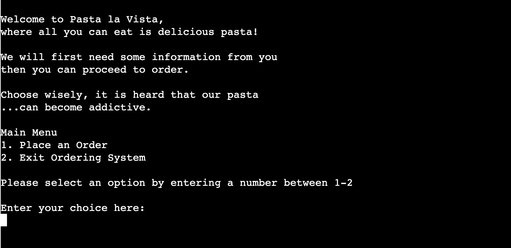
* The user has to choose between the two options. If the user's input is invalid then an error message will appear to inform and invite the user to try again.
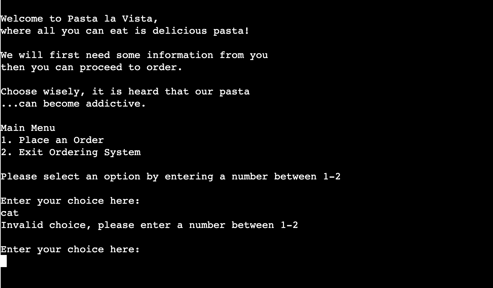
* The error message appears until the user's input is valid. If the user chooses the option two, then the system is exited.
* If the user chooses option one, then the order process starts.
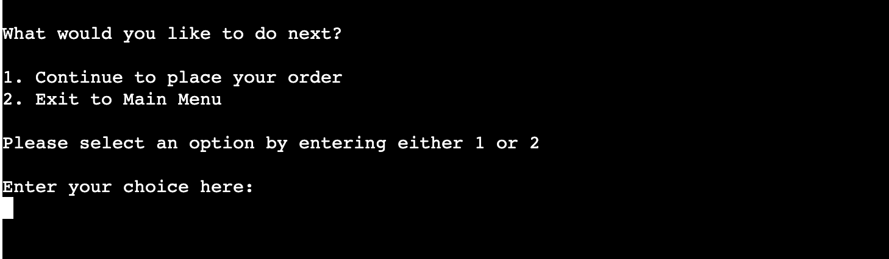
* From there, the user can either choose to go back to the Main Menu or continue to place the order.
### Place Order
### Customer details 
* The user is informed that first some details will be needed. The user is asked to provide the name.
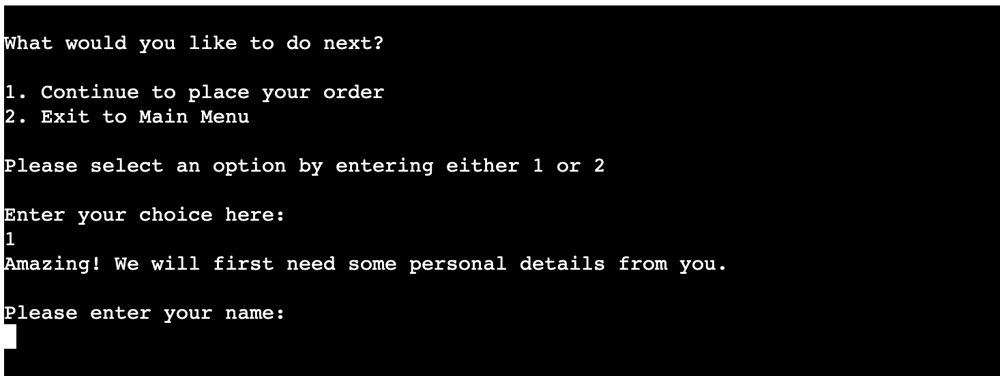
The user has to provide only alphabetical input. If this fails, then an error message appears and asks the user to try again.
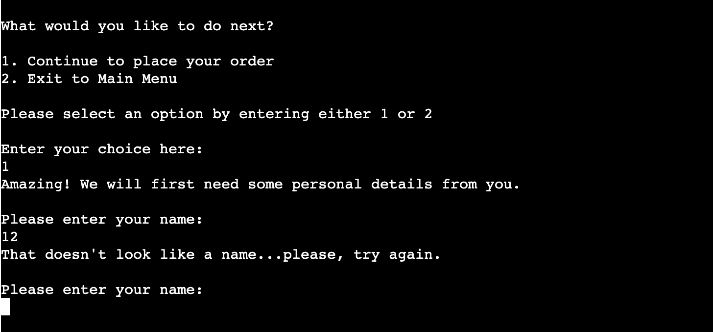
* After the name is provided, the user is asked for the address of delivery.

* If the user enters a space instead of the address, then an error message appears and asks the user to try again.

* A message appears confirming that the address has been received, then the user is asked for the telephone number.
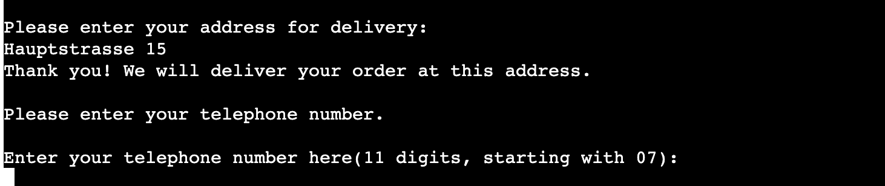
* The user has to enter a number with 11 digits and starting with 07, if that fails, an error message appears and asks for the user to try again.
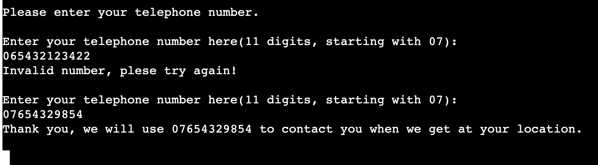
* A confirmation message of the number appears.

### Place Order
* A table presenting the menu of the restaurant is displayed. The user is asked to make a choice or type R to restart order, type E to exit to Main Menu.
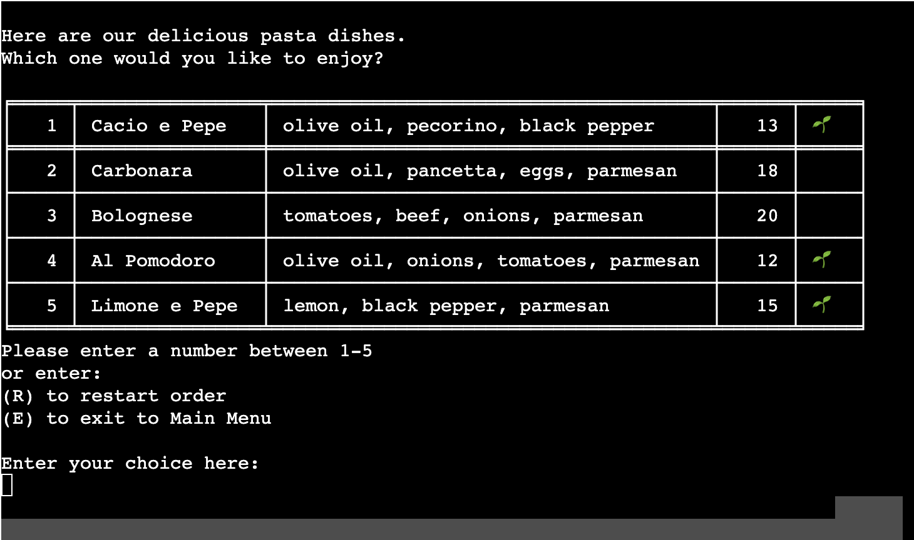
* If the user enters an invalid input, an error message appears and asks the user to try again, until the user's input is valid. A confirmation message appears.
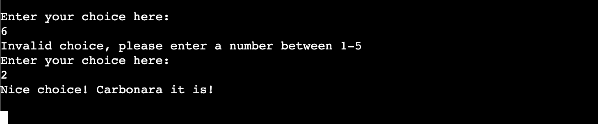
* A table presenting the type of pasta that the restaurant has is displayed. The user is asked to mae a choice or type R to restart order, E to exit to Main Menu.
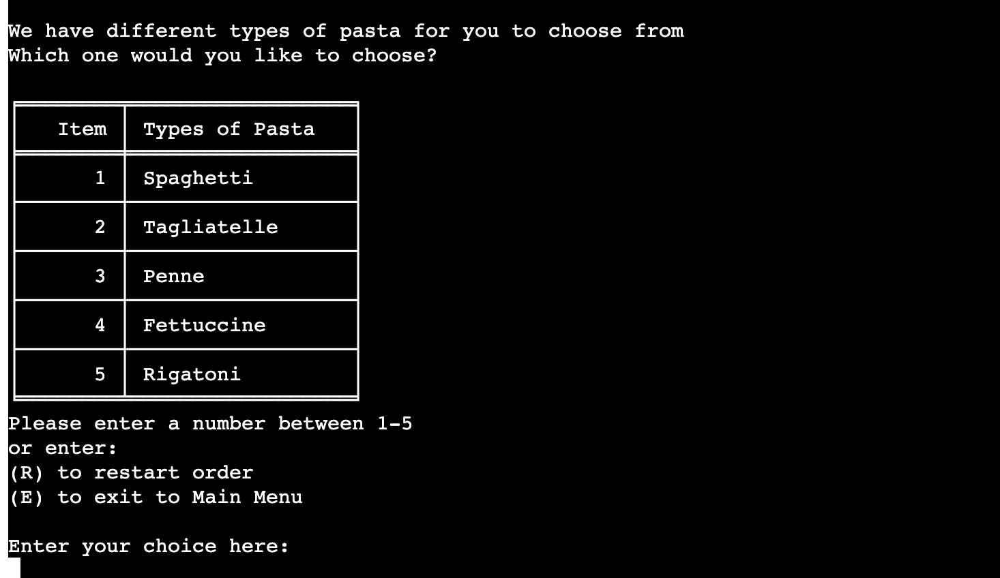
* If the user enters an invalid input, an error message appears and asks the user to try again, until the user's input is valid. A confirmation message appears.
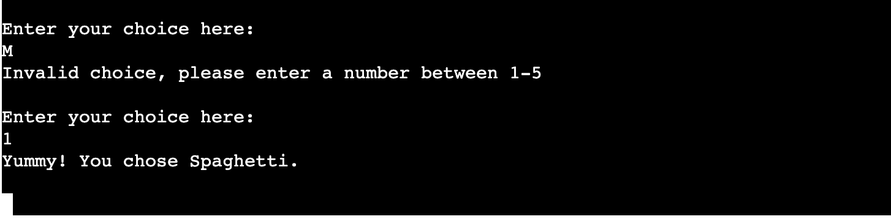
* Then, the user is being asked of how much of the selected dish they would like. If the user enters an invalid input, an error message appears and asks the user to try again, until the user's input is valid. A confirmation message appears.
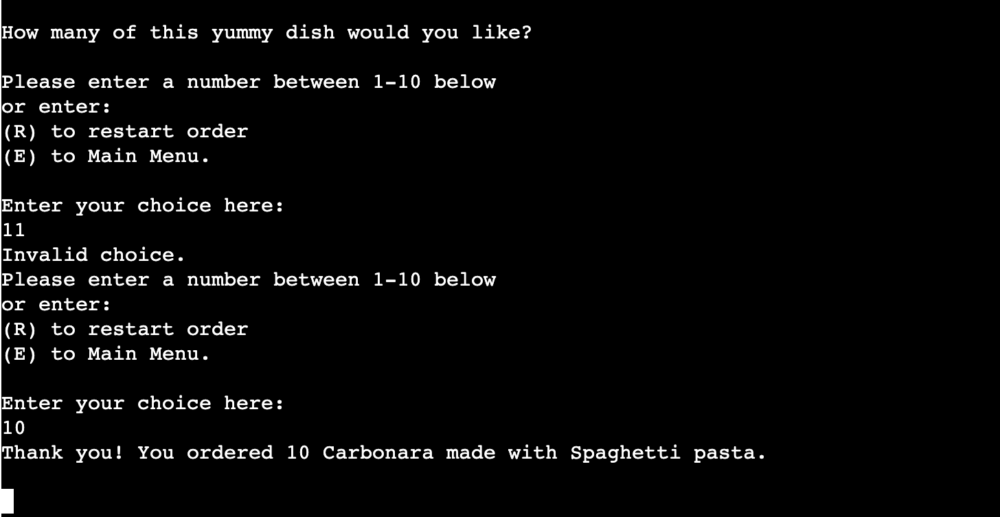
* The user is announced with the total cost of the order. The customer can choose whether to send order, restart order or exit to Main Menu.
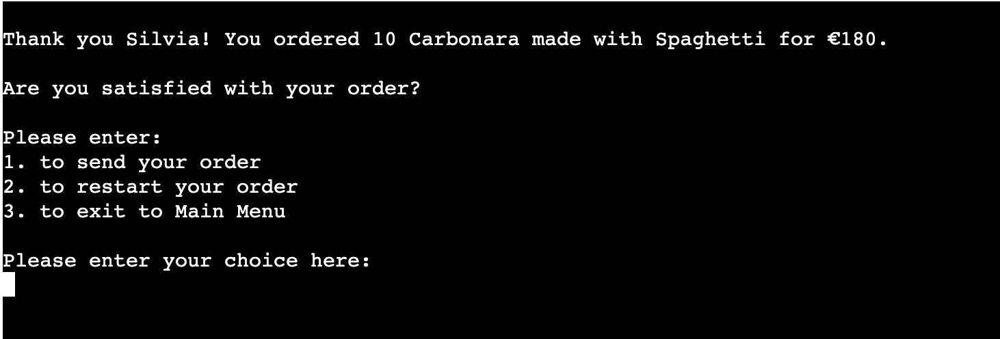
* If the user chooses to send the order then a confirmation on receiving the order will appear and the user is announced on how long will it take for the order to be delivered.
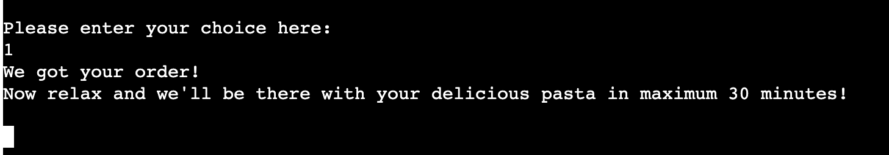
***

### Future Features
* A view order option where customers can see how busy the restaurant is at the moment.
* An online paying option for the customers.
* An application made for smartphones.
***

## Testing
### Testing User Stories
| Reference  | Description  |
|---|---|
| 01  | Easily determine the purpose of the application  |
| Validation  | The user can easily determine that this is an application where you can order food from Pasta la Vista restaurant.  |
| 02  | Be greeted when entering the application.  |
| Validation  | The customers are being greeted when entering the application.  |
| 03  | Start placing an order with ease.  |
| Validation  | The user can immediately choose to place an order from the main menu.  |
| 04  | Find out what dishes I can order.  |
| Validation  | A menu is being displayed for the user, after all the user's details have been completed.  |
| 05  | Find out what types of pasta I can choose for my dish.  |
| Validation  | The user is being presented with the types of pasta that the restaurant has.  |
| 06  | Order more of the same dish.  |
| Validation  | The user is able to order more of the same dish by entering a number between 1-10.  |
| 07  | Restart the order before placing it, in case I did a mistake during the order.  |
| Validation  | The user can restart the order at any time during ordering process.  |
| 08  | Be informed in how much time the order will be at my place.  |
| Validation  | After the order is confirmed, the user is being informed of how much time will take for the delivery.  |
| 09  | Provide a way for my customers to eat from the restaurant anywhere they like.  |
| Validation  | With the help of this command-line application, the customers can order from anywhere they like.  |
| 10  | Have stored data of orders and customer details so I can improve my business.  |
| Validation  | The orders are being received and stored in the google sheet "pasta-la-vista".  |
***
### Test Cases and Results
| Test Category  | Steps  | Expected Outcome  | Result  |
|---|---|---|---|
| Main Menu  | Run the application.   |  Welcome message. Main menu with option 1. Place order and option 2. Exit Ordering System. Ask the user to input an option. | Pass  |
| Main Menu - data checks  | Run the application, enter a variety of invalid inputs. e.g. cat, empty string, 6. | Error messsage apppears and asks the user to try again.  | Pass  |
| Main Menu - option 2  | Enter a value of 2.  | The application says goodbye and system is being terminated.  | Pass  |
| Main Menu - option 1  | Enter a value of 1.  | User can choose from option 1. Continue to place order and option 2. Exit to Main Menu. Ask the user to input an option.  | Pass   |
| Place Order - option 2  | Enter a value of 2.  | Main Menu is displayed.  | Pass  |
| Place Order - option 1  | Enter a value of 1.  | A table with the menu is displayed. Ask user to enter their choice (an input between 1 and 5).  | Pass   |
| Choose Pasta Dish - data checks  | Enter invalid inputs, e.g. cat, empty string, 10. | Error message appears and asks the user to try again.  | Pass  |
| Choose Pasta Dish  | Enter a valid input between 1 and 5.  | A confirmation message appears and a table containing the menu for the types of pasta is displayed. Ask user to enter an input between 1-5. | Pass  |
| Choose Pasta Type - data checks  | Enter invalid inputs, e.g. cat, empty string, 10.  | Error message appears and asks the user to try again.  | Pass  |
| Choose Pasta Type  | Enter a valid input between 1 and 5.  | A confirmation message appears. The the system asks the user the quantity of the dish that it is to be ordered. The quantity has to be between 1 and 10. | Pass  |
| Choose Quantity - data checks  | Enter invalid inputs, e.g. cat, empty string, 12  | Error message appears and asks the user to try again.  | Failed  |
|   |   |   |   |
|   |   |   |   |
|   |   |   |   |
|   |   |   |   |
|   |   |   |   |
|   |   |   |   |
|   |   |   |   |
|   |   |   |   |

